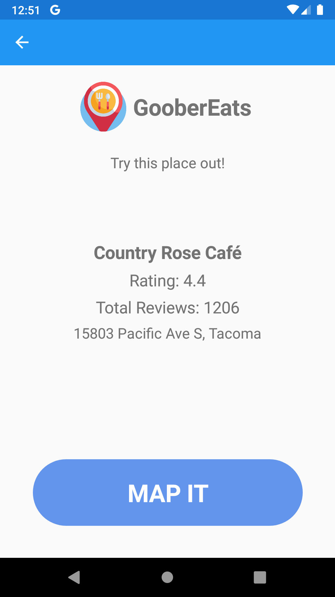

#  GooberEats
**Current Version:** 1.1  
**Last Updated:** July 12, 2020

[](#change-log)  [](https://docs.microsoft.com/en-us/dotnet/csharp/) [](https://docs.microsoft.com/en-us/xamarin/xamarin-forms/) [](https://docs.microsoft.com/en-us/aspnet/core/?view=aspnetcore-3.1) [](code_of_conduct.md)

## Table Of Contents
1. [Overview](#overview)
2. [Visuals](#visuals)
3. [Getting Started](#getting-started)
4. [Tools Used](#tools-used)
5. [Change Log](#change-log)
6. [App Permissions](#application-permissions)
7. [Author](#author)
8. [Attributions](#attributions)
9. [License](#license)

## Overview

GooberEats was built with _**you**_ in mind!

Have you ever been hungry, but were _too lazy to cook?_  
Want to order out but _don't know what sounds good?_  
Does your spouse / partner / friend always _ride the fence on where to eat?_

**Now there's GooberEats!**

GooberEats is a mobile _(Android)_ application that allows you to select a distance radius from your current location, and return a random restuarant within that radius.

See pertinent information about that restaurant such as its Google rating, the total number of ratings and reviews, and its address.

If the restaurant sounds appealing, there's even a button to view it directly in your device native Maps application for easy routing and further details!

## Visuals

|Application Main View|Application Distance Picker|Application Result View|Application Map Result|
|:-:|:-:|:-:|:-:|
|||||

## Getting Started

#### Getting Started (Users)
GooberEats will be available on the Google Play Store as soon as possible after initial release. Check back here for further instructions when that happens!

#### Getting Started (Developers)
To get started, you will need a few things. First, you'll need Git, which you can get [here](https://git-scm.com/).

You'll also need a copy of [Visual Studio 2019](https://visualstudio.microsoft.com/vs/community/). Installing the latest version will also install the latest versions of .NET / .NET Core.

Once you've installed Visual Studio, you will need to add a few workloads from the Visual Studio Installer:
- .NET Core cross-platform development
- ASP.NET and web development
- Mobile development with .NET
- Any other workloads that interest you

After you've ensured that your computer has installed all of the necessary software and components, you'll need to clone the GooberEats repo.

From your command prompt, enter the following:
```
git clone https://github.com/robertjnielsen/GooberEats.git
```

Then you'll want to navigate to the directory where you cloned the repository to, and open up the `GooberEats.sln` solution file in Visual Studio.

From there, you can modify, play with, or run the application. As this application also includes the GooberEatsAPI server, if you wish to run that locally as well, you will need to do a few things.

First, you need to open the solution properties by right-clicking on the `GooberEats.sln` file.

Under the `Common Properties > Startup Project` settings, check the radio button for `Multiple Startup Projects`.

Set both `GooberEats.Android` and `GooberEatsAPI` to `Start`, and then using the arrows to the right, move `GooberEats.Android` **below** `GooberEatsAPI`. This will allow the API server to startup before the Android application.

Finally, you can close the solution properties window, and select `Start` on your top toolbar. _(Note: If you haven't already configured an Android device emulator, Visual Studio will prompt you to do so. It's best to just go with the default settings, as these will work just fine.)_

## Tools Used

A number of tools were used in the development of GooberEats, ranging from various development tools, to web tools, and more. As many as possible will be listed here.

##### Development Tools
[Visual Studio 2019 Community Edition](https://visualstudio.microsoft.com/vs/community/) is the IDE / editor used during the development of this application. It enables development and debugging of applications and programs, working with static files such as images and markdown, and includes an integrated Android emulator.

[ASP.NET Core](https://docs.microsoft.com/en-us/aspnet/core/?view=aspnetcore-3.1) is the framework used to develop the GooberEatsAPI server.

[Xamarin.Forms](https://dotnet.microsoft.com/apps/xamarin/xamarin-forms) is used to develop the GooberEats Android application.

[C#](https://docs.microsoft.com/en-us/dotnet/csharp/) is the language used to develop both the GooberEats Android application, as well as the GooberEatsAPI server application.

[MVC](https://docs.microsoft.com/en-us/aspnet/core/mvc/overview?view=aspnetcore-3.1) or _Model-View-Controller_ is the application architectural pattern used to develop the GooberEatsAPI application. This pattern helps to seperate the data, business logic, and user interface from each other in order to help make it easier to develop, debug and test code, as it ensures each item in the process serves a singular function, as opposed to possibly having to make many broad changes in a variety of files.

[MVVM](https://docs.microsoft.com/en-us/xamarin/xamarin-forms/enterprise-application-patterns/mvvm) or _Model-View-ViewModel_ is the application architectural pattern used to develop the GooberEats Android application. Similar to the _MVC_ pattern, it helps to seperate the data, business logic, and user interface.

##### Web Tools
[json2csharp](https://json2csharp.com/) is a web application that allows the conversion of JSON response objects into C# classes for deserialization.

[Google Places API](https://developers.google.com/places/web-service/intro) is used to retrieve information about nearby restaurants. The entire GooberEats application was built around the premise of this API.

##### Cloud / Hosting Tools
[Azure App Services](https://azure.microsoft.com/en-us/services/app-service/) are used to host the GooberEatsAPI server, in order to query the Google Places API and feed the resulting data to the GooberEats Android application.

## Change Log

###### Version Legend:
There are a few different letters and numbers that you may see used during the versioning of this application. They are as follows:
- **#.# / #.## - Month DD, YYYY**
  - This is the basic version numbering you will see with every patch / update / release, followed by the date.
  - Single digits after the **.** indicate feature additions and improvements, while a double digit after the **.** indicates a bug-fix during the current release / feature number.
- **d**
  - The letter **d** after a version indicates a _development_ version, and is generally a pre-release / pre-public release version. These usually are not seen after **v1.0** and beyond.
- **b**
  - The letter **b** after a version indicates a _bug-fix_ in order to correct any bugs or issues discovered after a release. **_This does not stand for "beta" as it may in other applications._**
- **R**
  - The letter **R** after a version indicates that it is a _major release_. These occur when new and possibly prominant features are introduced into the application.

###### Version History

**v1.1 - July 12, 2020**
- Updated API uri from local debug URL to production URL.
- Modified distance radius values to more reasonable choices.
- Updated code comments throughout for legibility and ease of understanding.

**v1.0R - July 12, 2020**
- MVP reached. First complete release ready, will be submitting to Google Play Store as soon as possible.
- Added activity indicator upon search query submit.
- Fixed [bug](https://github.com/robertjnielsen/GooberEats/issues/9) that caused initial result to not exist, though subsequent queries were successful. Cause was determined to be in device location collection.

**v0.6d - July 11, 2020**
- ResultPage 100% complete (MVP).
- ResultPage includes button to open result in native device map application.

**v0.5d - July 10, 2020**
- ResultPage view 90% complete. Pertinent data from returned result displayed to user.
- ResultPage view scaffolded.

**v0.4d - July 10, 2020**
- API server responds to application query with formatted result response.
- App now queries API server with device location, and user selected distance radius.

**v0.3d - July 09, 2020**
- API server randomly selects one formatted result.
- API server queries Google Places API, and deserializes response.
- API server scaffolded.

**v0.2d - July 07, 2020**
- Application now detects user location.
- Main Page 100% complete (MVP).

**v0.1d - July 06, 2020**
- Main Page 90% complete.

**v0.0d - July 06, 2020**
- Initial project / documentation creation.

## Application Permissions

The following permissions are required to be enabled in order for Goober Eats to successfully operate:

**Location**
- Allowing the application to access device location settings is a requirement in order to locate nearby restaurants and determine a distance radius.

## Author

**Robert James Nielsen** is a U.S. Army veteran and a full-stack software engineer who enjoys developing ASP.NET Core web applications, as well as Xamarin.Forms Android applications.
- [GitHub](https://github.com/robertjnielsen)
- [LinkedIn](https://www.linkedin.com/in/robertjnielsen)

## Attributions

**Application Icon** made by [Freepik](https://www.flaticon.com/authors/freepik) from [www.flaticon.com](https://www.flaticon.com).

## License

GooberEats - Copyright © 2020

This program is free software: you can redistribute it and/or modify it under the terms of the [GNU General Public License version 3](https://www.gnu.org/licenses/gpl-3.0.en.html) as published by the [Free Software Foundation](https://www.fsf.org/about/).

This program is distributed in the hope that it will be useful, but WITHOUT ANY WARRANTY; without even the implied warranty of MERCHANTABILITY or FITNESS FOR A PARTICULAR PURPOSE.  See the [GNU General Public License](https://www.gnu.org/licenses/gpl-3.0.en.html) for more details.
